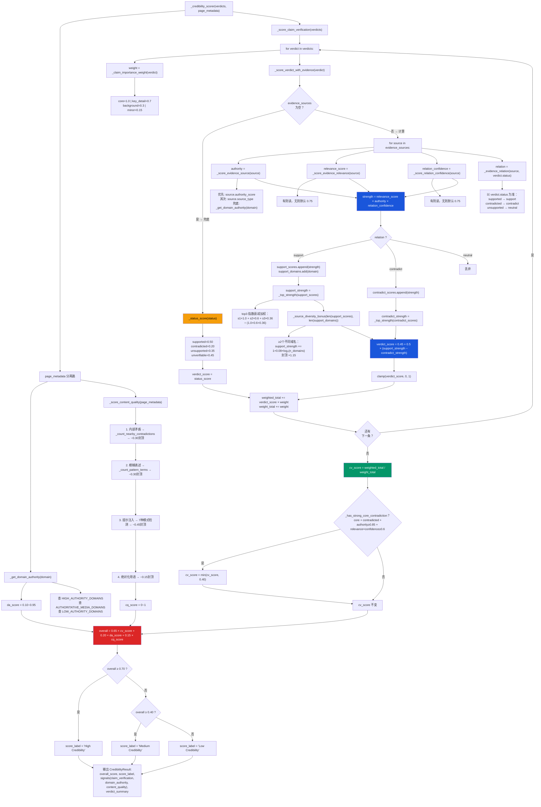

# credibility_scorer 评分流程图

## 关键变量说明

| 变量 | 类型 | 范围 | 含义 |
|------|------|:---:|------|
| `strength` | float | 0~1 | 单条证据的影响力强度 |
| `authority` (`authority_score`) | float | 0.10~0.95 | 证据来源权威性 |
| `relevance_score` | float | 0~1 | 证据与主张的相关程度 |
| `relation_confidence` | float | 0~1 | 支持/反驳判断的置信度 |
| `support_strength` | float | 0~1 | 所有支持证据聚合后的强度 |
| `contradict_strength` | float | 0~1 | 所有反驳证据聚合后的强度 |
| `verdict_score` | float | 0~1 | 单条主张得分 |
| `importance_weight` | float | 0.15~1.0 | 主张重要性权重 |
| `cv_score` | float | 0~1 | 主张验证总分（封顶0.40） |
| `da_score` | float | 0.10~0.95 | 域名权威分 |
| `cq_score` | float | 0~1 | 内容质量分 |
| `overall` | float | 0~1 | 综合可信度 |

## 关键函数说明

| 函数 | 作用 |
|------|------|
| `_score_evidence_source(source)` | 返回单条证据的权威性，按 authority_score → source_type → 域名白名单三级降级 |
| `_score_evidence_relevance(source)` | 返回证据相关性，有则读、无则默认 0.75 |
| `_score_relation_confidence(source)` | 返回关系置信度，有则读、无则默认 0.75 |
| `_evidence_relation(source, status)` | 返回 support/contradict/neutral，以 verdict.status 为准 |
| `_top_strength(scores)` | top-3 指数衰减聚合，γ=0.6，最强者权重最高不稀释 |
| `_source_diversity_bonus(n_scores, n_domains)` | 多源互证加分，≥2 域名触发，封顶 ×1.15 |
| `_status_score(status)` | 无 evidence_sources 时的兜底分 |
| `_claim_importance_weight(verdict)` | 按 claim_role 或 importance_weight 返回权重 |
| `_has_strong_core_contradiction(verdict)` | 检测 core 主张是否被高权威证据强力反驳 |
| `_get_domain_authority(domain)` | 域名查白/黑名单，返回权威分 |
| `_score_content_quality(meta)` | 从正文检测矛盾/模糊/注入/绝对化，只扣分 |
| `_score_claim_verification(verdicts)` | 所有主张加权聚合，返回总分 |
| `_credibility_scorer(verdicts, page_metadata)` | 主入口，调用以上全部，返回最终 JSON |
